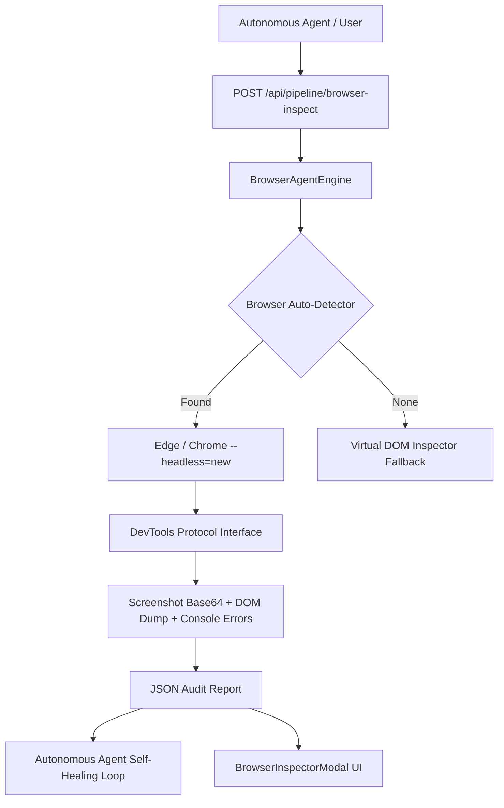

# 2026-09-27 Local Headless Browser & Visual Self-Correction Agent Design

## 1. Overview & Objectives

In modern autonomous AI builders (such as Devin, Cursor, and Replit Agent), generating code is only half the battle. When writing web applications, the AI must not be blind to runtime behavior: it must be capable of rendering pages locally, detecting unhandled runtime exceptions, spotting React hydration mismatches, auditing network asset failures (404s), and inspecting visual layout output.

### Objectives
1. **Zero-Download Headless Browser Engine (`lib/ai/browserAgentEngine.ts`)**:
   - Auto-detect local system browsers on Windows (Microsoft Edge at `C:\Program Files (x86)\Microsoft\Edge\Application\msedge.exe`, Google Chrome at `C:\Program Files\Google\Chrome\Application\chrome.exe`).
   - Launch headless instances using `--headless=new --remote-debugging-port` to execute full Chrome DevTools Protocol (CDP) commands with zero external browser downloads.
   - Capture viewport & full-page screenshots encoded in base64 PNG.
   - Intercept console messages (`console.error`, `console.warn`, unhandled exceptions) and network failures.
2. **API Endpoint (`/api/pipeline/browser-inspect`)**:
   - Provide `GET /status` to check local browser availability.
   - Provide `POST /audit` to run a headless audit on `http://localhost:<port>` or static HTML files.
3. **Autonomous Self-Healing Loop Extension (`lib/ai/autonomousAgentEngine.ts`)**:
   - Add visual & runtime console error feedback to the agent self-healing loop.
4. **Visual Inspector Studio Component (`client/components/BrowserInspectorModal.tsx`)**:
   - Live visual screenshot preview, DevTools console viewer, and 1-click "Auto-Heal UI Errors with AI" action.

---

## 2. Architecture



---

## 3. Component Details

### 3.1 `lib/ai/browserAgentEngine.ts`
- Detects browser binary path across standard Windows installation paths.
- Launches headless browser process with non-blocking child process spawning.
- Connects to DevTools WebSocket or executes automated inspection script.
- Handles graceful process cleanup with PID tracking and timeouts to avoid orphan processes.
- Returns structured `BrowserAuditResult`:
  ```typescript
  export interface BrowserAuditResult {
    success: boolean;
    url: string;
    title: string;
    screenshotBase64?: string;
    consoleLogs: Array<{ type: 'log' | 'warn' | 'error'; text: string; location?: string }>;
    errorsCount: number;
    warningsCount: number;
    domSummary: string;
    latencyMs: number;
    browserType: string;
  }
  ```

### 3.2 `app/api/pipeline/browser-inspect/route.ts`
- Handles GET for status and POST for page inspection.
- Validates URL (ensures local addresses like localhost, 127.0.0.1, or file://).

### 3.3 UI Integration (`client/components/BrowserInspectorModal.tsx`)
- Renders screenshot thumbnail with zoom modal.
- Formats console errors with line/column references.
- Triggers AI auto-patching loop.

---

## 4. Verification Plan
- Unit tests via `scripts/test-browser-agent.js`.
- HTTP API call to `/api/pipeline/browser-inspect` inspecting `http://localhost:3000`.
- Verify screenshot generation and error detection.
