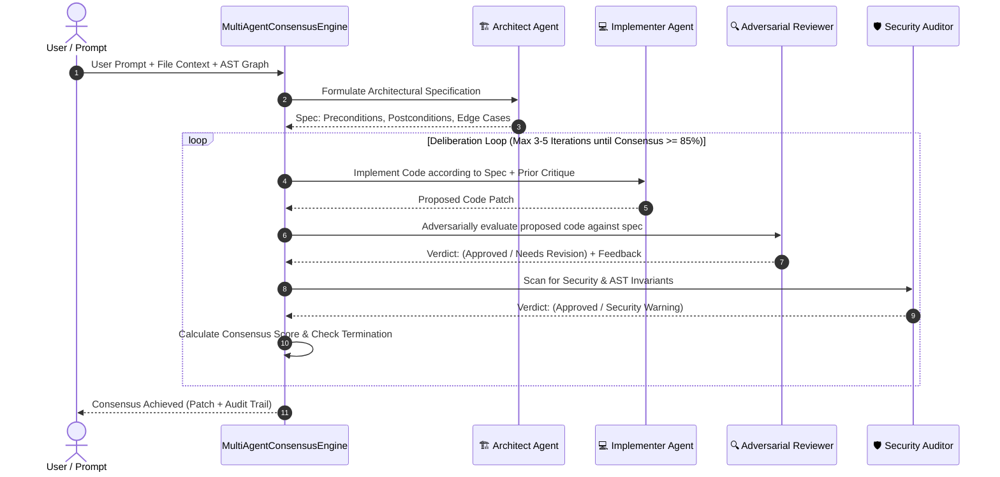

# Architectural Specification: Multi-Agent Consensus & Adversarial Verification Engine (Step 3)

**Date**: 2026-09-27  
**Status**: Approved (Option 1: Iterative Triad with Adversarial Critique)  
**Author**: Antigravity Assistant & Engineering Team  

---

## 1. Executive Summary

Autonomous coding agents frequently generate brittle code when operating as a single unified generator. When the same model generates and self-validates without an adversarial counterpart, it suffers from confirmation bias—overlooking subtle edge cases, unhandled null states, and security vulnerabilities that it inadvertently introduced.

**Step 3: Multi-Agent Consensus & Adversarial Verification** replaces single-pass generation with an orchestrated **Triad + Auditor debate framework**:
1. **Architect (Spec Agent)**: Extracts invariants, preconditions, error conditions, and structural contracts from user intent and the AST Knowledge Graph (Step 2).
2. **Implementer (Coder Agent)**: Writes the concrete production patch adhering strictly to the Architect's specification.
3. **Adversarial Reviewer**: Actively searches for counter-examples, race conditions, edge-case regressions, and missing invariants. If flaws are found, casts a `rejected` or `needs_revision` vote with an actionable critique.
4. **Security Auditor**: Verifies memory safety, XSS/injection protection, and lack of arbitrary dynamic execution (`eval`, `Function`).
5. **Consensus Evaluator**: Computes weighted consensus score. Once approval reaches $\ge 85\%$, the verified consensus patch is approved for atomic application to the workspace.

---

## 2. Architecture & Deliberation Flow



---

## 3. Data Structures

### 3.1 Agent Vote & State
```typescript
export type AgentRole = 'architect' | 'implementer' | 'reviewer' | 'auditor';
export type AgentVote = 'approved' | 'rejected' | 'needs_revision' | 'pending';

export interface SwarmAgentState {
  id: string;
  name: string;
  role: string;
  avatar: string;
  status: 'active' | 'idle' | 'failed' | 'completed';
  currentTask: string;
  progress: number;            // 0 - 100%
  score: number;               // 0.0 - 1.0 confidence score
  vote: AgentVote;
  lastLog: string;
  critique?: string;           // Actionable feedback if rejected
  executionTimeMs: number;
  tokensUsed: number;
}

export interface SwarmConsensus {
  overallVerdict: string;
  consensusScore: number;      // 0 - 100%
  status: 'agreed' | 'debating' | 'failed' | 'idle';
  totalTokens: number;
  iteration: number;
  maxIterations: number;
  agents: SwarmAgentState[];
  consensusCode?: string;      // Final verified patch
  specSummary?: string;        // Specification produced by Architect
}
```

---

## 4. Key Subsystems

### 4.1 `lib/ai/multiAgentConsensusEngine.ts`
- **Session Orchestrator**: Maintains active state, dispatches prompts to Ollama (`generateOllamaText`) or Cloud AI (`generateWithOnlineAi`), and coordinates debate cycles.
- **Deterministic Heuristic Fallback**: If local AI is offline, executes deterministic AST linting and static checks so the consensus loop remains functional air-gapped.
- **Convergence Guard**: Limits maximum debate cycles to 4 to prevent infinite debate oscillation.

### 4.2 API Routes
- `app/api/swarm/status/route.ts`:
  - `GET`: Returns latest session state, agent states, and consensus verdict.
  - `POST`: Triggers a step or consensus run (`{ action: 'start' | 'step', prompt, activeFile, files }`).
- `app/api/swarm/consensus/route.ts`:
  - Dedicated endpoint for streaming multi-agent consensus generation.

### 4.3 `components/SwarmTrackerPanel.tsx`
- Connects directly to the live consensus engine via API.
- Adds user prompt input box and "Run Multi-Agent Consensus" action.
- Real-time visual progress bars, vote badges, and debate transcript.
- 1-click "Apply Consensus Code" to active file in Monaco editor.

---

## 5. Verification Plan

1. **Unit Test**: `scripts/test-consensus-engine.js`
   - Executes multi-agent session with Architect, Implementer, Reviewer, and Auditor.
   - Asserts generation of spec, code patch, review critique, and consensus convergence.
2. **API Verification**:
   - `POST /api/swarm/status` with `{ action: 'start', prompt: 'Create validateEmail function', activeFile: 'utils.ts' }`.
   - Asserts response returns `status: 'agreed'`, `consensusScore >= 85`, and non-empty `consensusCode`.
3. **UI Integration**:
   - Verify `components/SwarmTrackerPanel.tsx` renders live agents and applies code cleanly to editor.
