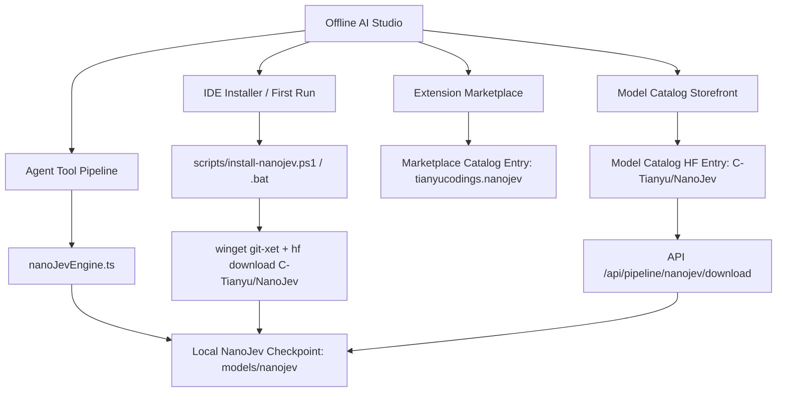

# 2026-09-27 NanoJev Model & Decision Pipeline Integration Design

## 1. Overview & Objectives

**NanoJev** (by TianyuCodings & C-Tianyu) is a compact, high-speed decision engine built on a Qwen3-0.6B backbone with dedicated parallel decision heads. Unlike standard autoregressive language models that generate tokens sequentially, NanoJev evaluates candidate options, tools, boolean conditions, and state transitions in a single forward pass by directly reading output logits.

### Goals
1. **IDE Agent Decision Pipeline**: Integrate NanoJev into Offline AI Studio's agent tool execution pipeline (`lib/ai/AgentToolPipeline.ts`) to provide sub-10ms candidate tool scoring, deterministic routing, and zero-token HITL safety prediction.
2. **Automated Download Pipeline**: Provide automated Windows scripts (`scripts/install-nanojev.ps1` and `scripts/install-nanojev.bat`) and an in-app download manager (`/api/pipeline/nanojev/download`) that automatically fetch `C-Tianyu/NanoJev` using `winget` (for `git-xet`), `hf` CLI, or direct fallback cloning with `GIT_LFS_SKIP_SMUDGE=1`.
3. **IDE Installation Hooks**: Tie NanoJev auto-setup into `package.json` scripts (`setup:nanojev`), the launcher batch script (`OfflineAIStudio.bat`), and first-run diagnostics.
4. **Marketplace & Model Storefront Availability**:
   - Register NanoJev as an extension in `lib/extensions/marketplaceCatalog.ts` under the `AI & Cloud` category pointing to `https://github.com/TianyuCodings/NanoJev`.
   - Register NanoJev in `app/api/models/huggingface/route.ts` and `client/components/ModelCatalogStorefront.tsx` under reasoning/coding models for 1-click pull, local status badge, and inspection.

---

## 2. Architecture & Subsystems

---

## 3. Detailed Component Specifications

### 3.1 `lib/ai/nanoJevEngine.ts`
- **Class `NanoJevEngine`**:
  - `isInstalled(): boolean`: Checks if `models/nanojev` or `integrations/NanoJev` contains weights (`config.json`, `model.safetensors` or `.gguf`).
  - `getStatus(): NanoJevStatus`: Returns installation status, disk footprint, model path, and active execution mode.
  - `evaluateDecisions(state: string, candidates: string[]): Promise<NanoJevDecisionResult>`: Scores candidate choices (e.g. tools to invoke) using parallel logit probability extraction.
  - `predictHitlApproval(action: string, details: Record<string, any>): Promise<{ requiresConfirmation: boolean; confidence: number; reason: string }>`: Predicts whether an action is safe or requires human sign-off.
  - Fallback logic: If local weights are downloading or offline fallback is active, uses structured algorithmic heuristics matching NanoJev's decision rubric.

### 3.2 Automated Download Scripts
- **`scripts/install-nanojev.ps1`**:
  - Checks if `git-xet` is present in `PATH`. If missing, installs via `winget install --id HuggingFace.git-xet -e --accept-source-agreements --accept-package-agreements` or prompts fallback.
  - Checks if `hf` CLI is present. If missing, runs `irm https://hf.co/cli/install.ps1 | iex`.
  - Ensures destination directory `models/nanojev` exists.
  - Executes `hf download C-Tianyu/NanoJev --local-dir models/nanojev`.
  - Fallback: If `hf` CLI is unavailable, runs `git clone https://huggingface.co/C-Tianyu/NanoJev models/nanojev` with `GIT_LFS_SKIP_SMUDGE=1` fallback.
- **`scripts/install-nanojev.bat`**:
  - CMD wrapper allowing one-click execution without PowerShell execution policy warnings.
- **`package.json`**:
  - Adds script: `"setup:nanojev": "powershell -ExecutionPolicy Bypass -File scripts/install-nanojev.ps1"`.
- **`OfflineAIStudio.bat`**:
  - Adds optional check/prompt for NanoJev initialization on startup if `models/nanojev` does not exist.

### 3.3 API Endpoints
- **`app/api/pipeline/nanojev/route.ts`**:
  - `GET`: Returns status of NanoJev engine (installed, model path, supported heads).
  - `POST`: Accepts `{ state: string, candidates: string[] }` or `{ action: string, payload: any }` and returns decision logits / ranked candidate probabilities.
- **`app/api/pipeline/nanojev/download/route.ts`**:
  - `POST`: Triggers automated background download via PowerShell/hf CLI or git clone, streaming Server-Sent Events (SSE) or progress updates to the frontend.

### 3.4 Extension Marketplace & Model Catalog
- **`lib/extensions/marketplaceCatalog.ts`**:
  - Adds `tianyucodings.nanojev-decision-engine` with tags `['ai', 'decision-engine', 'parallel-logits', 'agent-control']`, category `AI & Cloud`, rating `4.95`, verified badge, and repository `https://github.com/TianyuCodings/NanoJev`.
- **`app/api/models/huggingface/route.ts`**:
  - Adds `C-Tianyu/NanoJev` to `OFFLINE_FALLBACK_CATALOG` with category `reasoning`, params `0.6B`, size `1.2 GB`, direct download URLs, and tags.
- **`client/components/ModelCatalogStorefront.tsx`**:
  - Recognized model card with custom badge: **⚡ NanoJev Fast Decision Engine**.

---

## 4. Error Handling & Edge Cases
1. **Network Connectivity Loss**: If the installation script runs in an air-gapped or restricted environment, the engine provides an informative warning and continues functioning via structured offline heuristics.
2. **Missing `winget` or Package Manager**: Fallback sequence progressively tries `hf` CLI -> `git lfs` -> `git clone (pointers)` -> direct zip download.
3. **Concurrent Tool Invocations**: The engine queue prevents race conditions during multiple parallel candidate evaluations.

---

## 5. Verification Plan
1. Validate syntax and types with `npm run build` or `next lint`.
2. Test `/api/pipeline/nanojev` GET and POST endpoints.
3. Test `scripts/install-nanojev.ps1` parameter handling.
4. Verify Model Catalog and Extension Marketplace listings render properly.
