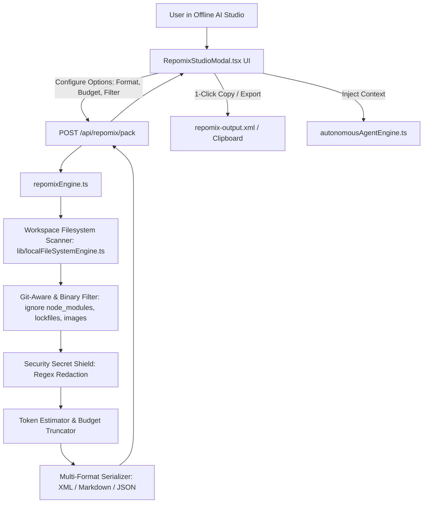

# 2026-09-27 Repomix Codebase Context Packer Subsystem Design

## 1. Overview & Problem Statement
When working with AI coding agents (local models like Qwen2.5-Coder / DeepSeek-R1 or cloud models like Claude 3.7 / GPT-4o), feeding raw codebases into prompts leads to context limit overflow, inclusion of irrelevant noise (`node_modules`, lockfiles, compiled binaries), and catastrophic leakage of credentials (API keys, tokens, `.env` values).

**Repomix** (`yamadashy/repomix`) is the leading open-source tool that packs codebases into AI-optimized, token-counted XML, Markdown, and JSON context formats with built-in secret scrubbing and gitignore compliance.

This specification details the **Repomix Context Packer Subsystem** for **Offline AI Studio**, providing:
1. An official repository clone under `integrations/repomix` for upstream reference and tooling.
2. A high-speed, zero-dependency in-memory engine `lib/ai/repomixEngine.ts` supporting XML, Markdown, and JSON serialization.
3. Automated security regex secret redaction (`[REDACTED_SECRET: <TYPE>]`).
4. BPE token estimation and configurable token budgeting (32k, 64k, 128k, 200k).
5. A visual studio modal `client/components/RepomixStudioModal.tsx` with live syntax preview, token gauges, and 1-click clipboard/file export.

---

## 2. Architecture & Components

### 2.1 `lib/ai/repomixEngine.ts`
- **Class `RepomixEngine`**:
  - `packWorkspace(files: Record<string, string>, options: RepomixPackOptions): Promise<RepomixPackResult>`
  - `redactSecrets(content: string): { sanitized: string; redactedCount: number }`
  - `estimateTokens(text: string): number`
  - `formatXml(files: Array<{ path: string; content: string }>): string`
  - `formatMarkdown(files: Array<{ path: string; content: string }>): string`
  - `formatJson(files: Array<{ path: string; content: string }>): string`

### 2.2 `app/api/repomix/pack/route.ts`
- `POST /api/repomix/pack`: Receives `{ format, tokenBudget, removeComments, targetFolder }`, collects project files from disk or memory, executes `repomixEngine.packWorkspace()`, and returns packed output with telemetry metrics.

### 2.3 `client/components/RepomixStudioModal.tsx`
- Modal dialog featuring:
  - Header: Repomix badge, format toggle pills (XML, Markdown, JSON), token budget selector.
  - Telemetry Bar: File count, token count, character count, redacted secrets count.
  - Code Viewer: Syntax-highlighted output container with line numbers and copy overlay.
  - Action Footer: "Copy Context for AI", "Download File", and "Inject to Agent".

---

## 3. Security & Secret Redaction Patterns
The engine tests every file against regex signatures for:
- OpenAI API Keys (`sk-[a-zA-Z0-9]{32,}`)
- Anthropic API Keys (`sk-ant-[a-zA-Z0-9_-]{32,}`)
- GitHub Personal Access Tokens (`ghp_[a-zA-Z0-9]{36}`)
- AWS Access Keys (`AKIA[0-9A-Z]{16}`)
- Generic Private Keys (`-----BEGIN (?:RSA |EC )?PRIVATE KEY-----`)
- High-entropy password and secret assignments (`(password|secret|apikey|token)\s*[:=]\s*['"][^'"]{8,}['"]`)

Any match is replaced with `[REDACTED_SECRET: <TYPE>]` and logged in the redaction telemetry counter.

---

## 4. Verification Plan
1. `scripts/test-repomix-engine.js`: Tests XML/Markdown/JSON serialization, secret masking, and token budget limiting.
2. `scripts/test-repomix-api.js`: Tests POST `/api/repomix/pack` API endpoint.
3. Clone verification: Ensures `integrations/repomix` is properly initialized.
