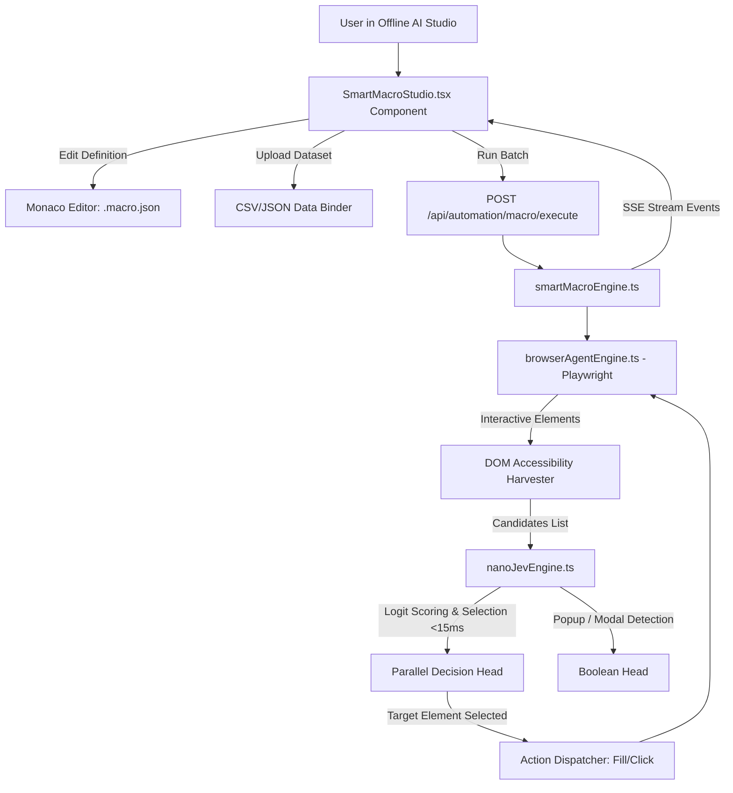

# 2026-09-27 Smart Macro Automation & Web/CRM Auto-Filler Subsystem Design

## 1. Overview & Problem Statement
Repetitive web and desktop workflows (e.g., entering hundreds of CRM leads from a CSV/Excel file, submitting online forms, data migration between enterprise portals) are traditionally automated using either:
1. **Coordinate-based AutoClickers (e.g. TinyTask, Klick'r)**: Brittle to window resizing, DPI scaling, and screen resolution shifts.
2. **Hardcoded CSS/XPath Scripts (e.g. Selenium, AutoX.js scripts)**: Brittle to frontend DOM redesigns, dynamic class changes, or A/B testing variations.
3. **Heavy Vision-Language Models (e.g. Mobile-Agent, GPT-4V)**: Prohibitively slow (3,000–8,000ms latency per step), high cloud API cost, and privacy concerns for sensitive enterprise data.

This specification details the **Smart Macro Automation Subsystem** for **Offline AI Studio**, integrating:
- **Playwright DOM & Accessibility Harvester** for zero-download local browser interaction via existing Microsoft Edge/Google Chrome.
- **NanoJev Parallel Decision Engine** (`lib/ai/nanoJevEngine.ts`, Qwen3-0.6B backbone) to score candidate elements in **sub-15ms** using output logits without autoregressive text generation delay.
- **Editable Macro Schema (`.macro.json`)** rendered and edited directly in the IDE's Monaco Editor.
- **Batch CSV/JSON Binding** for high-speed, self-healing form entry.
- **Side-by-side Visual Studio Panel** (`client/components/SmartMacroStudio.tsx`) providing live progress, field mapping, and execution streaming.

---

## 2. Macro Definition & Data Schema

### 2.1 File Format: `.macro.json`
Macros are stored in human-readable JSON within the user's workspace (e.g., `automations/crm-lead-entry.macro.json`).

```typescript
export interface SmartMacroStep {
  id: string;
  action: 'navigate' | 'smartFill' | 'smartClick' | 'selectOption' | 'wait' | 'checkPopup';
  targetIntent?: string;       // Natural intent (e.g., "Customer Phone", "Full Name", "Save CRM Lead")
  value?: string;              // Static value or template (e.g., "{{csv.phone}}")
  csvField?: string;           // Optional explicit key binding from CSV/JSON row
  options?: {
    timeoutMs?: number;
    optional?: boolean;        // Skip step gracefully if not found
    confirmDialog?: boolean;   // Auto-dismiss native alerts/dialogs
    delayAfterMs?: number;     // Human typing cadence
  };
}

export interface SmartMacroDefinition {
  id: string;
  name: string;
  description: string;
  targetUrl: string;
  mode: 'browser' | 'desktop_app';
  csvData?: Array<Record<string, string>>;
  steps: SmartMacroStep[];
  concurrency?: number;
  createdAt: string;
  updatedAt: string;
}
```

---

## 3. Subsystem Architecture & Components



### 3.1 `lib/automation/smartMacroEngine.ts`
- **Class `SmartMacroEngine`**:
  - `inspectPageElements(url: string)`: Opens Edge/Chrome in headless or headed mode and extracts all interactive elements with accessible attributes:
    `{ id, tagName, type, name, placeholder, labelText, ariaLabel, selector, visible, boundingBox }`.
  - `matchElementWithNanoJev(targetIntent: string, elements: DOMElementCandidate[])`:
    - Encodes each element into candidate representation: `[input type="tel"] placeholder="Mobile" name="phone"`.
    - Invokes `nanoJevEngine.evaluateDecisions(state, candidates)`.
    - Returns best matching element selector with confidence score.
  - `executeMacroBatch(macro: SmartMacroDefinition, onProgress: (event: MacroProgressEvent) => void)`:
    - Iterates over each row in `csvData`.
    - Replaces template variables `{{csv.key}}`.
    - Executes steps with auto-retry and popup detection.
    - Yields real-time events via Server-Sent Events (SSE).

### 3.2 `app/api/automation/macro/route.ts` & Endpoints
- `POST /api/automation/macro/inspect`: Inspects a given web URL, returning found form inputs and candidate buttons.
- `POST /api/automation/macro/execute`: Executes a macro batch, streaming progress logs via SSE.
- `GET /api/automation/macro/templates`: Returns ready-to-use macro templates (CRM lead generation, Google Form submitter, E-commerce inventory updater).

### 3.3 Frontend: `client/components/SmartMacroStudio.tsx`
- **Left Panel (Visual Runner & Control)**:
  - URL input & "Inspect Page" button.
  - CSV file upload and table preview.
  - Step timeline with interactive badges, action types, and intent labels.
  - "Run Macro Batch" trigger with live progress bar and status console.
- **Right Panel (Editable Monaco Editor)**:
  - Embedded Monaco editor loaded with `.macro.json`.
  - Bi-directional sync: modifying JSON updates the visual timeline immediately.

---

## 4. Error Handling & Self-Healing

1. **Popup & Alert Interception**:
   - Playwright dialog listener auto-accepts or logs alerts.
   - NanoJev Boolean Head verifies if a modal overlay is blocking inputs and triggers auto-dismissal.
2. **Missing Field Graceful Fallback**:
   - If an optional field is absent on the page, the macro continues to the next step without aborting the batch.
3. **Bot Detection Avoidance**:
   - Keystrokes are typed with slight human jitter (20–60ms randomized interval) to ensure CRM inputs fire change listeners correctly.

---

## 5. Verification Plan

1. **Unit Tests**:
   - Create `scripts/test-smart-macro-engine.js` validating:
     - Macro definition parsing and template variable substitution.
     - Element extraction and NanoJev semantic matching against sample HTML test fixtures.
     - Execution simulation with a mock dataset.
2. **Integration Verification**:
   - Run the test script using `node scripts/test-smart-macro-engine.js`.
   - Verify API routes respond correctly with 200 OK.
3. **IDE Visual Verification**:
   - Verify `SmartMacroStudio.tsx` renders cleanly in the Offline AI Studio workspace.
