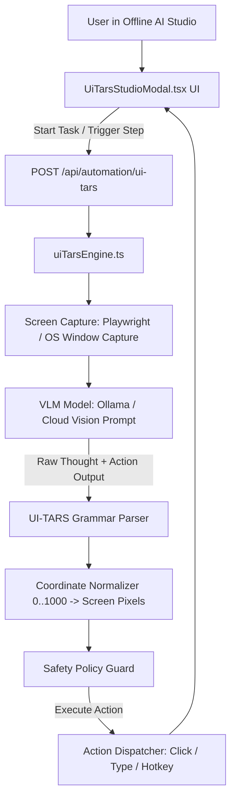

# 2026-09-27 UI-TARS Computer-Use & Desktop GUI Agent Subsystem Design

## 1. Overview & Problem Statement
While DOM-based automation (like our NanoJev Smart Macro Studio) excels at web pages, enterprise software frequently relies on **native Windows desktop applications** (e.g., Tally ERP, SAP GUI, Microsoft Excel, legacy CRM clients, canvas tools) where no HTML DOM exists.

**UI-TARS** (`bytedance/UI-TARS`) is ByteDance's state-of-the-art vision-language GUI agent that perceives arbitrary graphical user interfaces via screenshots and outputs structured computer-use actions.

This specification details the **UI-TARS Subsystem** for **Offline AI Studio**, providing:
1. An official repository clone under `integrations/ui-tars` for model specifications and benchmark prompts.
2. A native TypeScript engine `lib/ai/uiTarsEngine.ts` that parses UI-TARS action syntax (`click(point=[X, Y])`, `type(...)`, `hotkey(...)`, `drag(...)`, `finished()`) and scales normalized 0..1000 coordinates to actual display pixels.
3. Safety guards to prevent destructive desktop commands (`alt+f4`, raw formatting, hard kills).
4. Backend API endpoint `app/api/automation/ui-tars/route.ts` handling screen capture, action parsing, and step dispatch.
5. A visual studio modal `client/components/UiTarsStudioModal.tsx` displaying live screenshots with red click crosshairs and action logs.

---

## 2. Architecture & Components

### 2.1 `lib/ai/uiTarsEngine.ts`
- **Interfaces**:
  - `UiTarsActionType`: `'click' | 'type' | 'hotkey' | 'scroll' | 'drag' | 'wait' | 'finished'`
  - `UiTarsParsedAction`: Parsed action with point coordinates `[x, y]`, content, hotkey, and confidence.
  - `UiTarsStepResult`: Screenshot base64, raw model text, parsed action, scaled coordinates, and execution status.
- **Class `UiTarsEngine`**:
  - `parseAction(modelOutput: string): UiTarsParsedAction`
  - `scaleCoordinates(point: [number, number], screenWidth: number, screenHeight: number): [number, number]`
  - `validateActionSafety(action: UiTarsParsedAction): { safe: boolean; reason?: string }`
  - `executeAction(action: UiTarsParsedAction, options?: UiTarsExecuteOptions): Promise<boolean>`

### 2.2 `app/api/automation/ui-tars/route.ts`
- `POST /api/automation/ui-tars`:
  - `action: 'parse'`: Parses UI-TARS model response string into structured JSON action.
  - `action: 'scale'`: Scales 0..1000 coordinates to viewport width/height.
  - `action: 'execute'`: Executes action on target browser page or desktop.

### 2.3 `client/components/UiTarsStudioModal.tsx`
- Interactive modal with:
  - Header: UI-TARS branding badge, screen resolution indicator.
  - Screen Canvas: Live screenshot preview with dynamic red target crosshair overlay at predicted `(X, Y)`.
  - Action Timeline: Step-by-step audit trail showing Thought, Action, Coordinates, and Latency.
  - Execution Controls: Step mode, Run Continuous, and Emergency Stop button.

---

## 3. Verification Plan
1. `scripts/test-ui-tars-engine.js`: Tests parsing of `click(point=[500, 320])`, `type(content="admin")`, `hotkey(key="ctrl+s")`, coordinate scaling, and safety guard interception.
2. `scripts/test-ui-tars-api.js`: Tests `/api/automation/ui-tars` route.
3. UI verification in IDE workbench.
